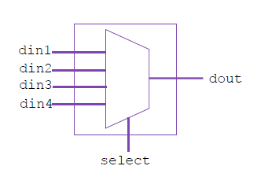
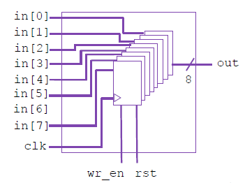

# Laboratorios realizados en FODISEGUA 2026
Universidad Galileo

Universidad de San Carlos de Guatemala

Kevin Lajpop

# Herramientas utilizadas
Para este laboratorio se utiliza Systemverilog en una Raspberry Pi 4 pero puede ejecutarse en cualquier plataforma que cuente con Systemverilog

# Laboratorio 1
Creación de un multiplexor de 4x1 como se muestra en la siguiente imagen:



la solución de este laboratorio está en la carpeta 1. Lab I/lab1.sv

Creación de un banco de registros como se muestra en la siguiente imagen:


# Laboratorio 2
Realizar el test de lo realizado en el laboratorio 1. Por ejemplo:

```bash
 iverilog -g2012 -o sim lab1.sv ../2. Lab II/tb_mux4.sv
 ```